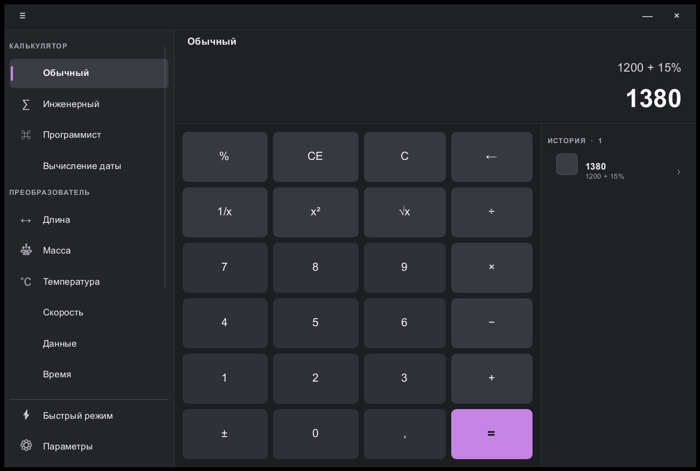

# LumaCalc

[](https://github.com/Rerowros/lumacalc/actions/workflows/ci.yml)
[](#license)

LumaCalc is a small, offline, keyboard-first desktop calculator for Windows 10/11, written in Rust with a
[Slint](https://slint.dev) UI. You type what you mean — `1200 + 15%`, `15 мб`, `10 km -> miles`, `sqrt(144)` —
and get an exact answer instantly, either in a full workspace window or in a compact always-on-top overlay
summoned from anywhere with `Win + Alt + Space`. No web runtime, no network, no telemetry, no background service.



> Status: early preview (v0.1). The UI is currently in Russian; the full product contract lives in
> [`openspec/`](openspec/changes/build-native-calculator/) and most of it is still roadmap.

## Features

- **Free-form expressions** — operator precedence, functions (`sqrt`, `sin`, `log`, …), constants, a leading `=` is
  accepted, decimal comma is understood (`1,5 + 2,5`).
- **Human percentages** — `100 + 50%` is `150`, `200 - 10%` is `180`, while `200 * 10%` stays `20`.
- **Unit conversion in plain text** — length, mass, temperature, speed, time, area, volume, energy, pressure, angle,
  with Russian aliases (`1 км в метры`, `5 kg -> lb`, `20 C -> F`).
- **Data sizes done right** — decimal vs binary (`MB` vs `MiB`) and bits vs bytes (`Mbit` vs `MB`) are never
  confused; a bare quantity like `15 MB` shows popular equivalents, and rates (`15 Мбит/с`) stay rates.
- **History** — the last 30 calculations, click to recall.
- **Quick overlay** — global `Win + Alt + Space` toggles a compact always-on-top bar that expands into the full
  workspace.
- **Opt-in launch at sign-in** — a per-user `HKCU\…\Run` entry that starts LumaCalc hidden (`--background`), toggled
  from Settings; off by default, never registered implicitly.
- **Private by construction** — evaluation is fully local; currency rates are deliberately unavailable offline
  rather than fetched.

## Architecture

The repository is a Cargo workspace with a strict split between calculation logic and everything that touches the OS
or the screen:

```
apps/calculator-desktop     Slint UI + wiring (thin presentation layer, the only binary)
  └─ ui/app.slint           declarative UI, compiled to Rust at build time by slint-build
crates/calc-engine          headless, deterministic engine: parsing, percent rules, units, data sizes
crates/calc-platform-windows  Win32 adapters: global hotkey thread, per-user startup registry value
openspec/                   spec-driven product contract (requirements, scenarios, task gates)
packaging/                  per-user install / uninstall scripts
```

- **Engine vs platform.** `calc-engine` has no UI or OS dependencies (built on
  [`fend-core`](https://crates.io/crates/fend-core) and [`rust_decimal`](https://crates.io/crates/rust_decimal)),
  returns stable error codes such as `E_DIV_ZERO` / `E_OFFLINE_RATE`, and is tested without rendering anything.
  `calc-platform-windows` owns every Windows-specific call and compiles to harmless stubs on other targets, so the
  app layer never talks to Win32 directly.
- **Why Slint.** A native, declarative toolkit with no browser engine or JS runtime: the `.slint` markup is compiled
  into Rust at build time, the app uses the winit backend with Slint's software renderer (no GPU driver
  dependencies, predictable idle cost), and the whole program ships as a single self-contained `.exe`.
- **`unsafe` policy.** `unsafe_code` is denied workspace-wide and `calc-engine` additionally declares
  `#![forbid(unsafe_code)]`. The only `unsafe` in the project is confined to `calc-platform-windows`: two small Win32
  FFI blocks for the hotkey message loop (`RegisterHotKey` / `GetMessageW`) and its shutdown
  (`PostThreadMessageW`). Registry access goes through the safe `windows-registry` API.
- **Lints.** Clippy `all` + `pedantic` at warn level, enforced as errors in CI (`-D warnings`).
- **Release profile.** Thin LTO, `opt-level = "s"`, `panic = "abort"`, stripped symbols.

## Build & install

Requirements: Windows 10/11 and Rust **1.95** (pinned in `rust-toolchain.toml`, installed automatically by rustup).

```powershell
# run a debug build
cargo run -p calculator-desktop

# build the optimized executable -> target\release\calculator-desktop.exe
cargo build --release -p calculator-desktop
```

Install for the current user only — no admin rights, no machine-wide changes:

```powershell
.\packaging\install-user.ps1                 # copies to %LOCALAPPDATA%\Programs\LumaCalc + Start Menu shortcut
.\packaging\install-user.ps1 -EnableStartup  # same, and enable launch at sign-in
.\packaging\uninstall-user.ps1               # removes the exe, the shortcut and LumaCalc's own startup entry
```

See [`packaging/README.md`](packaging/README.md) for details. Prebuilt executables are attached to
[GitHub Releases](https://github.com/Rerowros/lumacalc/releases) for every `v*` tag.

## Tests

```powershell
cargo test --workspace
cargo clippy --workspace --all-targets -- -D warnings
cargo fmt --all --check
```

The engine tests pin the user-visible semantics: precedence, contextual vs fractional percent, decimal comma,
Russian unit aliases, and exact bit/byte/MiB conversions. CI runs all three commands on `windows-latest`.

## License

Licensed under either of

- Apache License, Version 2.0 ([LICENSE-APACHE](LICENSE-APACHE))
- MIT license ([LICENSE-MIT](LICENSE-MIT))

at your option. © 2026 Iaroslav.

Unless you explicitly state otherwise, any contribution intentionally submitted for inclusion in the work by you, as
defined in the Apache-2.0 license, shall be dual licensed as above, without any additional terms or conditions.
